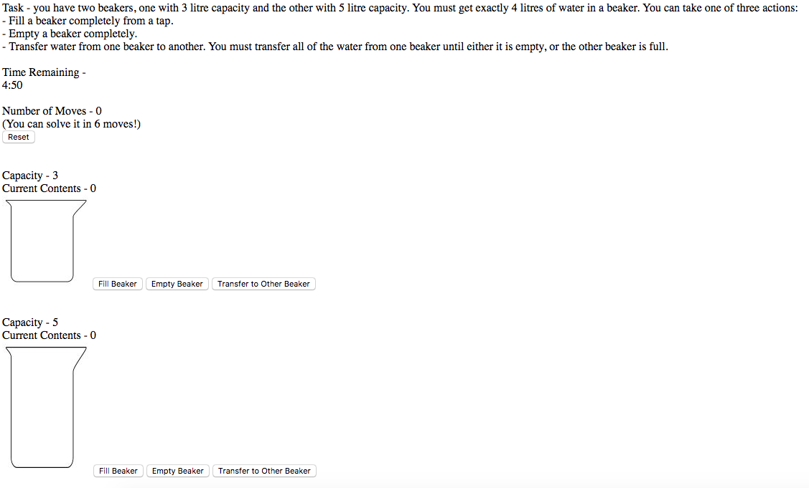
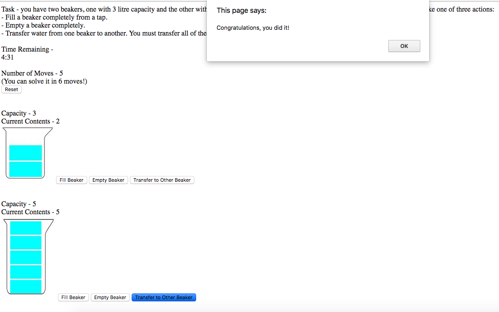
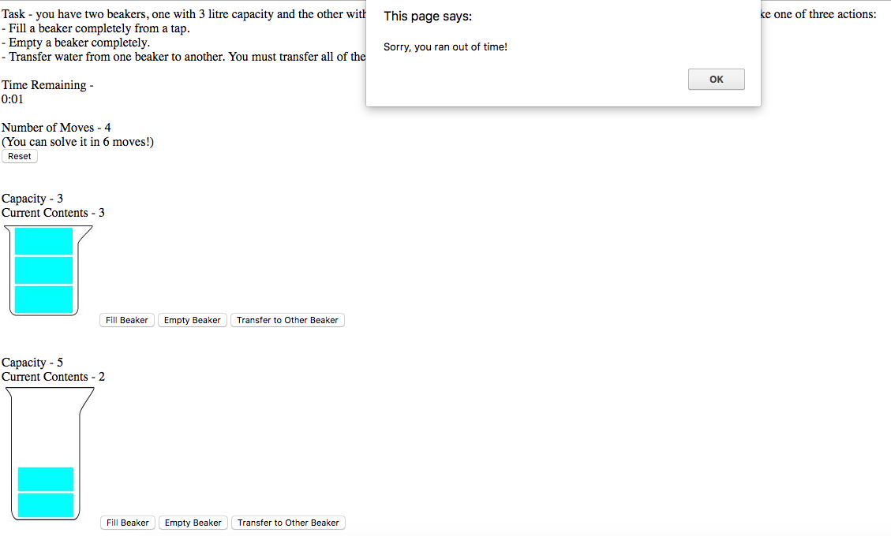

# Being Bruce

## How to Run
* Clone or download the repo to your local machine
* Navigate to the project folder in your terminal
* To launch the app in browser, type **open index.html**
* To test, type **open SpecRunner.html**

## Description
The problem that is presented is as follows:
* You have two beakers - one with capacity of 3 litres and the other with capacity of 5 litres.
* You can fill a beaker completely with water from a tap.
* You can empty a beaker completely.
* You can transfer water from one beaker to the other. You transfer water until either the beaker you are transferring from is empty, or the beaker you are transferring to is full.
* Using only the above actions, you must end up with exactly 4 litres in a beaker.

## Approach and Structure
My approach was to construct a simple one page web-application using JavaScript and jQuery.

The back end logic which controls...
* creation of beakers
* filling and emptying beakers
* transferring water between beakers

...is quite simple and is contained with the files **beaker.js** and **transfer.js**

The **app.js** file utilises jQuery to update both attributes of the beaker objects, and also UI elements within the **index.html** file which contains the html executed on running the app.

The code for the timer which runs at the top of the app is located in **timer.js**

The UI is relatively simplistic, but content is dynamic - the beaker images, beaker contents and the number of moves which have been made all update with each button clicked.

## Lessons Learned
* I found the back-end logic of creating beakers and changing their water levels to be relatively easy, but the front-end was more complex due to the range of interactions possible.
* Tooling - I had originally planned to use Node.JS to set up a simple server for the application. As I wrote an initial design, however, I came to the conclusion that this was likely over-complicating the solution. I decided to simplify and write a single html page with a javascript backend and jQuery to handle dynamic content. I found I had to shift my thinking from back-end, which is more natural to me, to thinking of it as more of a front-end problem. However, this had an undesirable knock-on effect to my testing, as described below.
* Testing - the front-end code is not tested as much as I would like. My main struggle was attempting to test jQuery. I eventually realised that the wrapping of a number of functions within **$( document ).ready(function() {}** inside app.js made them almost impossible to test. I would like to do some further reading into whether there are alternative patterns which can produce the same end result but allow me to take a more TDD-centric approach.
* Timer - the timer was one area where I particularly struggled, having not implemented anything like it before. I was not sure how to make content dynamic without invoking a button click, form submission or similar. This is the one area where I had to rely on a tutorial to implement the feature. It gave me an opportunity to learn about Javascript's *setTimeout()* method.

## Screenshots

App upon launch

Upon successfully reaching a solution

Upon running out of time

